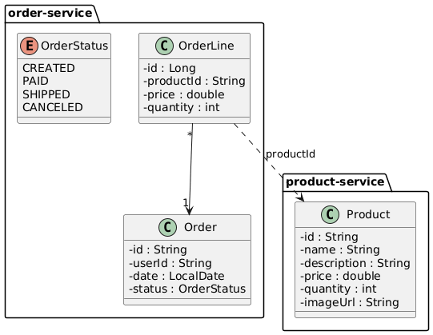
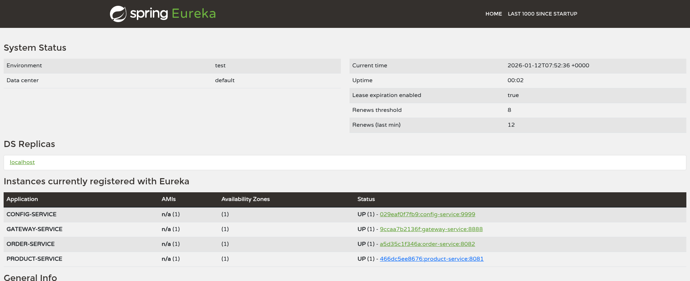
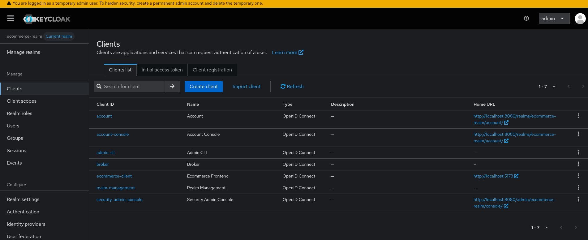

<p align="center">
  
</p>

<h1 align="center">S E C U R E - C O M</h1>

<h4 align="center"><b>Fennec</b> est une application open source d’audit de sécurité des serveurs avec support IA.</h4>

<p align="center">
    
    
    
    
    
</p>

# **Secure Microservices E-Commerce Platform**

This project is a robust, cloud-native e-commerce application built using a **Microservices Architecture**. It demonstrates a secure, scalable, and modern full-stack implementation, leveraging **Spring Boot** for the backend ecosystem and **React (Vite)** for the frontend.

The primary focus of this project is to implement industry-standard security practices (DevSecOps), centralized configuration, service discovery, and efficient inter-service communication within a distributed system.


---

## Key Features

* **Microservices Architecture**: Decoupled services for better scalability and maintainability.
* **Centralized Configuration**: Managed via Spring Cloud Config Server.
* **Service Discovery**: Dynamic service registration using Netflix Eureka.
* **API Gateway**: Central entry point for routing, load balancing, and security enforcement.
* **Advanced Security (OAuth2/OIDC)**: Integrated with **Keycloak** for robust Authentication and Authorization across all services.
* **Inter-Service Communication**: Synchronous communication using OpenFeign.
* **Modern Frontend**: Built with React, TypeScript, and Vite for a fast and responsive user experience.
* **DevSecOps Integration**: Includes CI/CD workflows and SonarQube analysis for code quality and security.
* **Containerization**: Fully Dockerized environment with Docker Compose orchestration.

---

## Architecture

The system is composed of several autonomous services working together. Below is the high-level architecture:



### Backend Services

| Service | Port | Description |
| :--- | :--- | :--- |
| **Discovery Service** | `8761` | Netflix Eureka Server for service registration and discovery. |
| **Config Service** | `8888` | Centralized configuration server for all microservices. |
| **Gateway Service** | `8080` | Spring Cloud Gateway acting as the single entry point. Handles routing and security. |
| **Product Service** | `8081` | Manages product catalog, inventory, and details. |
| **Order Service** | `8082` | Handles order placement, processing, and management. |

### Frontend Application

| Component | Port | Description |
| :--- | :--- | :--- |
| **Client App** | `5173` | React application (Vite) serving the user interface. |

---

## Technology Stack

### Backend
* **Framework**: Java 21, Spring Boot 4.0.1
* **Spring Cloud**: Gateway, Config, Netflix Eureka, OpenFeign
* **Security**: Spring Security, Keycloak (OAuth2 / OpenID Connect)
* **Database**: PostgreSQL
* **Build Tool**: Maven

### Frontend
* **Framework**: React.js
* **Build Tool**: Vite
* **Language**: TypeScript
* **Styling**: Tailwind CSS
* **State Management**: Context API

### DevOps & Tools
* **Containerization**: Docker, Docker Compose, Docker Buildx
* **Identity Management**: Keycloak (OAuth2 / OIDC)
* **CI/CD Pipeline**: GitHub Actions (DevSecOps Workflow)
* **Static Analysis (SAST)**: SonarQube
* **SCA & Vulnerability Scanning**: OWASP Dependency-Check
* **Infrastructure & Container Security**: Aqua Security Trivy
* **Secret Detection**: GitLeaks
* **Build Management**: Maven, Node.js (Vite)

---

## Getting Started

Follow these instructions to set up the project locally.

### Prerequisites
* **Docker** and **Docker Compose** installed.
* **Java 21+** (optional if running via Docker).
* **Node.js 18+** (optional if running via Docker).

### Installation

1.  **Clone the repository**
    ```bash
    git clone https://github.com/jaouad4/secure-microservices-ecommerce.git
    cd secure-microservices-ecommerce
    ```

2.  **Environment Configuration**
    Ensure the `docker-compose.yml` file is configured correctly. The project uses a `docker-init` folder to initialize the database and Keycloak realms automatically.

3.  **Run with Docker Compose**
    Build and start the entire ecosystem with a single command:
    ```bash
    docker-compose up -d --build
    ```

    *Note: The first run might take a few minutes as it downloads dependencies and initializes the Keycloak database.*

4.  **Verify Services**
    * **Discovery Server (Eureka)**: [http://localhost:8761](http://localhost:8761)

    * **Keycloak Console**: [http://localhost:8080](http://localhost:9090)

    * **Frontend Application**: [http://localhost:5173](http://localhost:5173) (or configured port)

---

## Security & Authentication

This project uses **Keycloak** as the Identity and Access Management (IAM) provider.

* **Realm**: `ecommerce-realm`
* **Client ID**: `ecommerce-client`
* **Public Access**: Product browsing is open.
* **Protected Access**: Ordering and Account management require login.

**Default Credentials (for testing):**
* **Admin User**: `admin` / `admin123`
* **Standard User**: `client` / `client123`

---

## Project Structure

```bash
secure-microservices-ecommerce/
├── backend/
│   ├── config-service/       # Central Configuration
│   ├── discovery-service/    # Service Registry
│   ├── gateway-service/      # API Gateway & Security
│   ├── order-service/        # Order Management Logic
│   └── product-service/      # Product Management Logic
├── frontend/                 # React Application
├── docker-compose.yml        # Container Orchestration
└── docker-init/              # SQL & Keycloak Init Scripts
```

## Application Preview

### User Interface
The following screenshots demonstrate the core functionalities and user flows of the platform.

| Step | Description | Screenshot |
| :--- | :--- | :--- |
| 01 | Home Page - Product Catalog |  |
| 02 | Client Authentication |  |
| 03 | Product Management |  |
| 04 | Checkout Process |  |
| 05 | Order History |  |

### Administrative Dashboard
The administration area allows full control over the ecosystem.

| Feature | Description | Screenshot |
| :--- | :--- | :--- |
| Admin Access | Secure login for administrators |  |
| Inventory Control | CRUD operations for products |  |

### Infrastructure Monitoring
| Component | Description | Screenshot |
| :--- | :--- | :--- |
| Service Discovery | Netflix Eureka dashboard showing healthy instances |  |
| IAM Console | Keycloak realm and client configuration |  |
